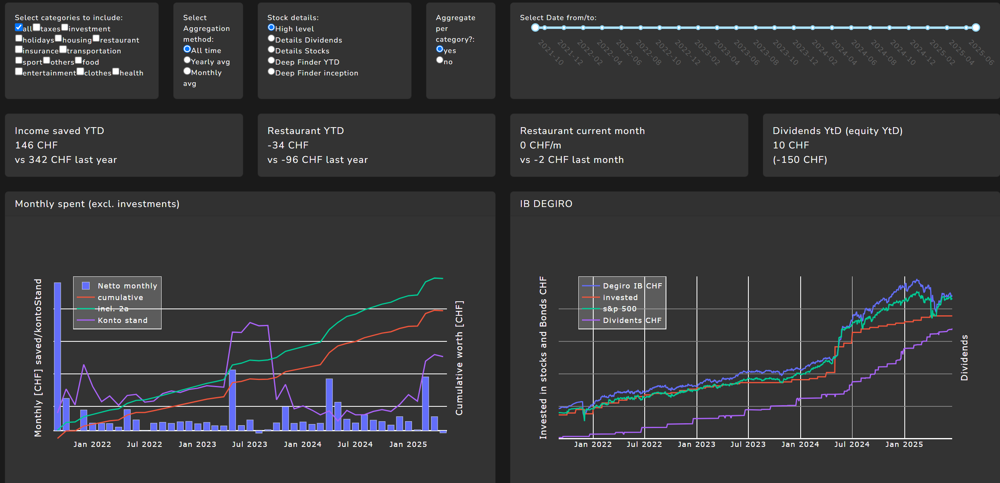
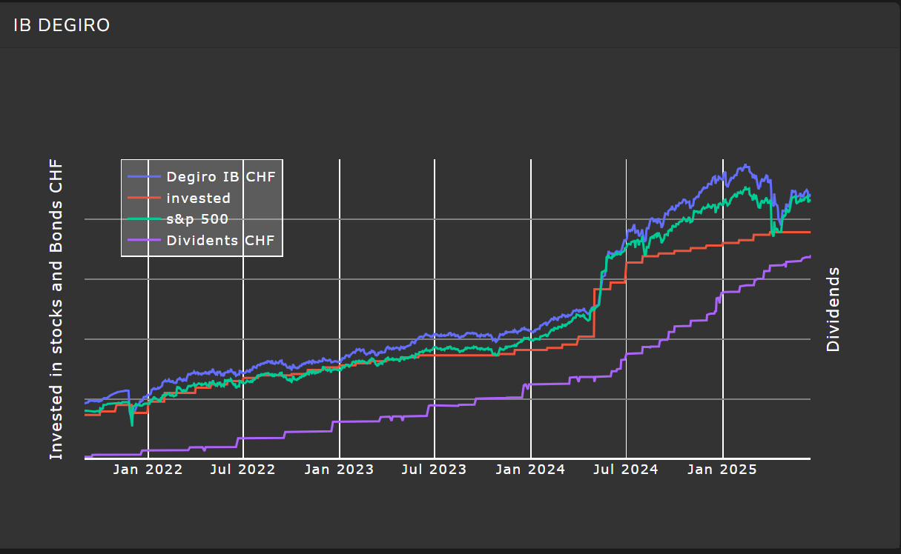
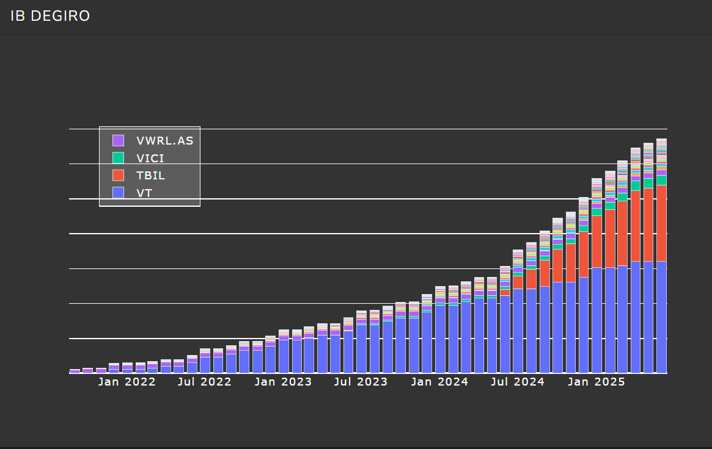
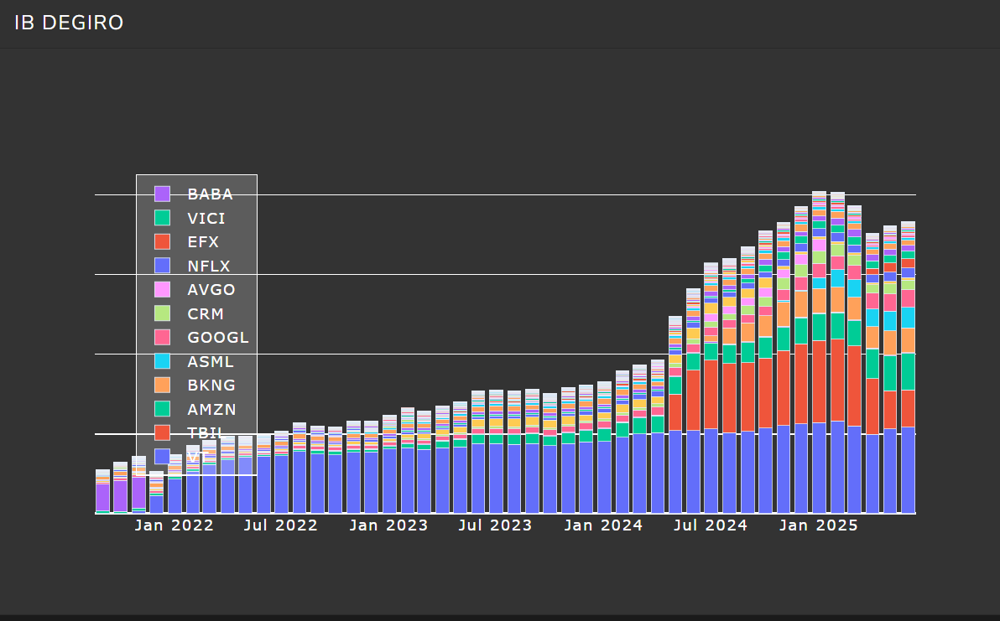
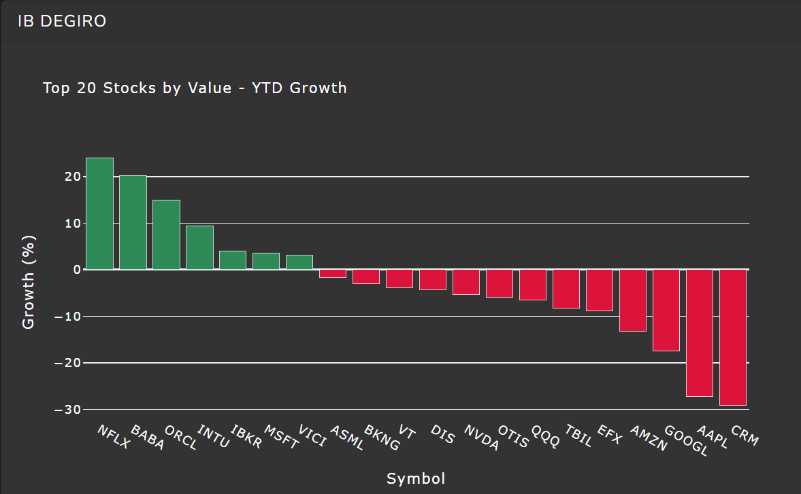
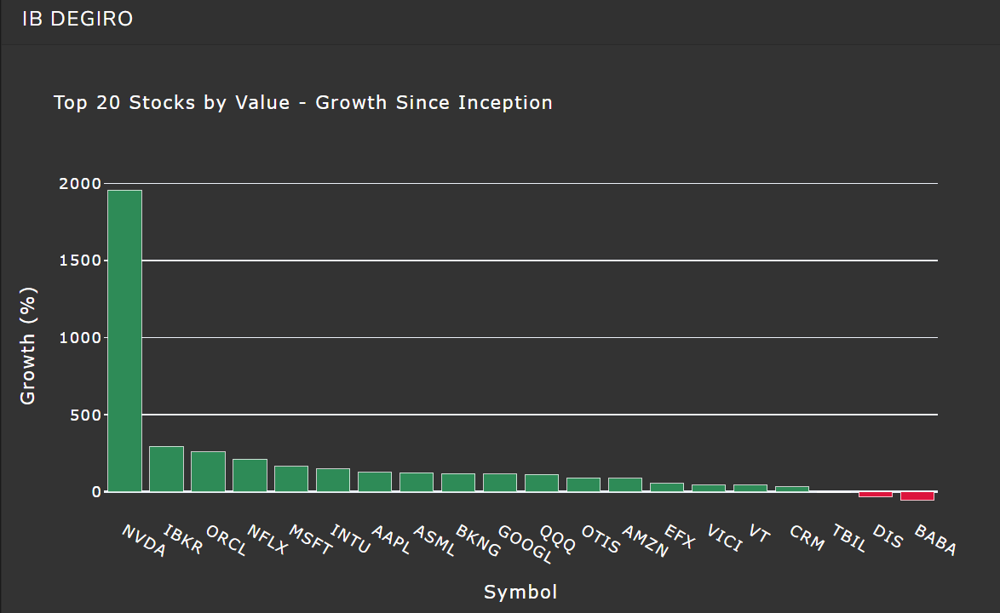
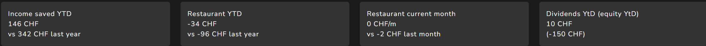
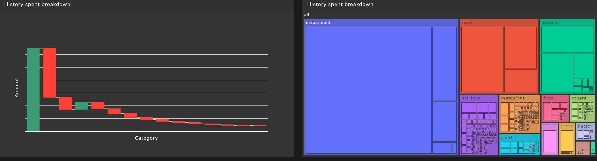
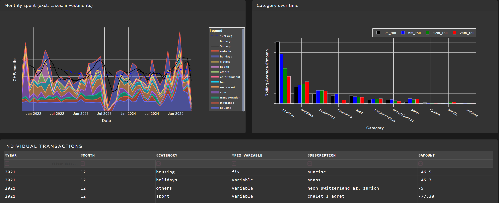

🚀 **Usage**  
├── Run **degiro_IB.py** to retrieve all trading data (stock closing, FX etc)  
├── Run **overview_free.py** to prepare all the banking data and display it

The Dashboard has four sections:
- A range of **filters** to modify the data being visualised
- Some high level **KPIs**
- A few different **graphs**
- A list of **all transaction** within the filtered range to help deep dive.

The first graph "Monthly spent (excluding investment)" shows on the left axis how much money has been saved per month, as well as how much is remaining on the bank account (Konto Stand). On the right axis you see two cummulative curves of wealth: 1) Cummulative which reprensent wealth invested (bank account + deposited on trading platform), 2) "incl. 2a" is for swiss usage and to reprensent how much is on top in the pillar 2a retirement fund.

Only the third dropdown is a bit more complex (called **Stock details**), it allows you to visualise different aspects of your investments.
- The default "High Level". You can see four curves displayed on two y axis On the right axis you can see accumulated dividends overtime. On the left axis you can see the following:
    - How much you invested "invested"
    - A benchark of the s&p 500, I chose VT ETF
    - Actual performance "Degiro IB CHF"

- The "Details Dividends" and "Details Stocks". It shows the cummulated dividends of the stocks (or stock value). To make it visible only dividends which represent 2% of the total would be displayed

  
  

- The "Deep finder YTD" and "Deep finder inception". It shows the growth (YTD or since inception) of your top 20 stocks, which could help identify buy opportunities.

  
  

**KPI section**, I have chosen to display four KPIs important to me:

- Income saved YTD vs last year (this is purely how much has been put aside and does not consider unrealised gains/lose)
- Restaurant YTD vs last year (As we go often to the restaurant I find it important to monitor it)
- Restaurant current month vs last month
- Dividends YTD and equity YTD

1) Waterfall to see how you spend your money
2) A tree map to visualise the larger categorise and deep dive in the sub categorise

Below we see the lsat 3 graphs of the dashboard: 
1) A monthly spent (excluding investment) of the dashboard, stacked values. As well as 3 ,6, 12 months rolling average
2) How is the spend per category is evolving overtime (i.e. holidays 3, 6, 12, 24 months rolling)
3) A list of individual transactions (can be filtered using categorise or date time filters)

How to set it up:
1) Download all the files (Bank transacations and Stocks transactions in the corresponding folder)
2) In InputFiles\Initialisation you need to initiate the dashboard with the following information
3) Column Description: Start Date Dashboard (put the date from which you started to use this account)
4) Below add your total wealth value with the category "salary" and day one day before point 2a
5) You can add with a negative value, how much left your account for investment (initiating them as well), category investment
6) In Switzerland we get a second pillar, thus I initiate how much I have at the date from 2a, category is also investment
7) In file pillar 2a, for each for put the date until which you received a given value of pillar 2a, category pillar 2a
8) In file taxes you can smooth your taxes, in column description you can put "taxes_delete", or "tax_add_manual" to add or remove transaction so they are spread monthly

InputFiles/ ├── Degiro/ │ └── Degiro_deposit.csv ├── example_data/ │ └── .gitkeep ├── exception/ │ └── .gitkeep ├── Exception_csv ├── Initialisation ├── neon ├── Postfinance ├── swisscard ├── ZKB