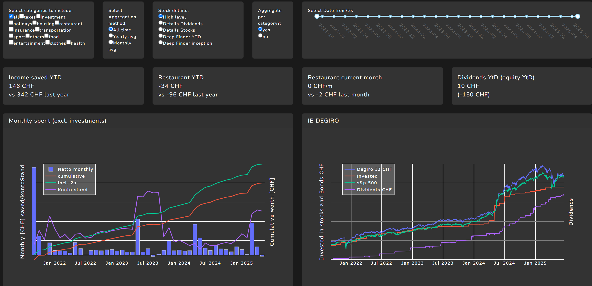

# 💰 Personal Finance Dashboard

A Dash-based personal finance dashboard that aggregates bank transactions, credit card statements, and stock trading data into interactive visualizations.

## 🚀 Quick Start

```bash
pip install -r requirements.txt
```

### First-time setup
1. Clone the repo and run `python overview_free.py` once — it will **auto-create** all missing folders and template CSV files
2. Follow the setup steps below to populate your data
3. Run `python degiro_IB.py` to fetch stock/trading data (requires internet)
4. Run `python overview_free.py` to launch the dashboard at http://127.0.0.1:8050

### Updating data
1. Drop new bank/card CSVs into the corresponding `InputFiles/` folders
2. Run `degiro_IB.py` if you have new trading data
3. Run `overview_free.py` to refresh the dashboard

## 📊 Dashboard Overview

The dashboard has **six sections**:
- **Filters** — Category, aggregation method, stock view, date range
- **KPIs** — Income saved YTD (with saving rate), restaurant spend YTD/monthly, dividends YTD, XIRR
- **Cumulative graph** — Monthly savings, bank balance, cumulative wealth
- **Investment graph** — Portfolio value vs benchmark (VT ETF), dividends, XIRR, deep finder
- **Spending breakdown** — Waterfall chart (with transaction counts), treemap, stacked area, category rolling averages
- **Year-over-Year comparison** — Compare any category's monthly spend across years
- **Transaction table** — Filterable list of all transactions



## 🔧 How to Set It Up

### Step 1: Add your bank data

Drop CSV files into the corresponding folders under `InputFiles/`:

| Bank/Source | Folder | Format |
|---|---|---|
| Neon | `InputFiles/neon/` | Yearly CSVs from the app (semicolon-separated) |
| Swisscard | `InputFiles/swisscard/` | Download from web portal (comma-separated) |
| ZKB | `InputFiles/ZKB/` | Export from e-banking (semicolon-separated) |
| Postfinance | `InputFiles/Postfinance/` | CSV or XML from e-banking |
| Degiro | `InputFiles/Degiro/` | Yearly transaction CSVs |
| Interactive Brokers | `InputFiles/IB/` | Activity Statements > Year to date > CSV |
| Degiro deposits | `InputFiles/Degiro_deposit/` | Account statement CSV |

### Step 2: Initialize your starting balances

Edit the files in `InputFiles/Initialisation/` (templates are auto-created):

**bank_init.csv** — Your starting point:
```
Date,Amount,...,Description,...,category
01/10/2021,,,,,Start Date Dashboard,,,,,,
30/09/2021,5000,,,,salary,,salary,,no,no,salary
30/09/2021,-2000,,,,Degiro,,investment,,no,no,investment
```
- Set the `Start Date Dashboard` row to when you want tracking to begin
- Add your initial bank balance as "salary"
- Add initial investment platform balances as negative "investment" amounts

**pillar2a.csv** — Monthly employer pension contribution:
```
Date,Amount,...,Description,...,category
01/01/2022,200,,,,pillar2a,,taxes,,,,pillar2a
```
- Each row defines the monthly pillar 2a amount starting from that date
- Add a new row when the amount changes (e.g. salary raise)

**taxes_init.csv** — Tax smoothing (optional):
```
Date,Amount,...,Description,...,category
30/09/2021,-4500,,,,taxes_delete,,taxes,,,,taxes
01/10/2021,-375,,,,tax_add_manual,,taxes,,no,no,taxes
```
- Use `taxes_delete` to remove lump-sum tax payments
- Use `tax_add_manual` to add smoothed monthly amounts instead

### Step 3: Set up categorization flags

Edit CSV files in `InputFiles/Flags/` (empty files are auto-created). Each file contains one keyword per line (no header). A transaction is categorized if its description contains any keyword from the flag file.

| Flag file | Category | Example keywords |
|---|---|---|
| `flag_salary.csv` | salary | `salary`, `payroll` |
| `flag_restaurant.csv` | restaurant | `Pizzeria`, `Uber Eats`, `TWINT` |
| `flag_food.csv` | food | `Migros`, `Coop`, `Denner` |
| `flag_house.csv` | housing | `Sunrise`, `rent`, `electricity` |
| `flag_taxes.csv` | taxes | `Kanton Zurich`, `Steueramt` |
| `flag_transportation.csv` | transportation | `SBB`, `Lime` |
| `flag_insurance.csv` | insurance | `Sanitas`, `CSS` |
| `flag_holidays.csv` | holidays | `SNCF`, `Airbnb`, `hotel` |
| `flag_entertainment.csv` | entertainment | `Spotify`, `Netflix`, `cinema` |
| `flag_sport.csv` | sport | `Decathlon`, `ski pass` |
| `flag_health.csv` | health | `pharmacy`, `Amavita` |
| `flag_clothes.csv` | clothes | `Zara`, `H&M` |
| `flag_investments.csv` | investment | `Degiro`, `Interactive Brokers`, `Viac` |
| `flag_pillar2a.csv` | pillar2a | `pension fund` |
| `flag_other.csv` | others | `Apple`, `Amazon` |
| `flag_twint.csv` | (sub-filter) | Keywords to identify Twint transfers |
| `flag_drop_row.csv` | (delete) | Keywords for duplicate transactions to remove |
| `flag_pirates.csv` | website | Keywords for website-related costs |

⚠️ **Important**: Flags are checked as substrings, so keep them specific enough to avoid false matches (e.g. `Ooki` would match `Booking.com`).

### Step 4: Exception rules (optional)

**categorization_exceptions.csv** in `InputFiles/Exception_csv/` — Override categorization for specific transactions:
```
description_substring,amount_min,amount_max,year_condition,year_min,year_max,month_condition,month_min,month_max,date_min,date_max,new_description,new_category,new_month,new_year,subject,category, Memo
SBB,,-700,,,,,,,,,,,,,,,Half tax annual pass
```
- Rules are matched top-to-bottom, first match wins
- Put specific rules before generic ones
- Use `&` for AND conditions on year/month ranges, `|` for OR

**manual_correction.csv** in `InputFiles/Exception_csv/` — Delete and re-add transactions to fix dates or categories:
```
Task,year,month,day,Amount,Description,category,fix_variable
delete_row,2025,3,31,253,airbnb,holidays,variable
add_row,2025,2,1,253,airbnb,holidays,variable
```
- `delete_row` removes matching transactions (day/amount/description are optional filters)
- `add_row` inserts a new transaction
- Useful for moving refunds to match the original charge date

**personal_config.csv** in `InputFiles/Initialisation/` — Personal settings (auto-created with placeholders):
```
key,value
phone_number,YOUR_PHONE_NUMBER
```
- `phone_number` — Your Swiss mobile number (used to parse Postfinance Twint descriptions)

**manual_stock_additions.csv** in `InputFiles/IB/` — Manually add stock positions not captured by IB/Degiro exports:
```
Date,Symbol,Quantity,Asset Category,Currency
2024-01-15,AAPL,10,Stocks,USD
```
- Useful for corporate actions, stock splits, or positions transferred from other brokers

## 📁 Repository Structure

```
├── overview_free.py          # Main dashboard (run this)
├── degiro_IB.py              # Stock data fetcher (run before dashboard)
├── main_pandas_exceptions.py # Data processing pipeline
├── theme.py                  # Theme configuration
├── requirements.txt          # Python dependencies
├── assets/
│   └── bootstrap.css         # Custom CSS overrides
├── datasets/                 # Generated CSVs (auto-created)
│   ├── spent_all.csv         # All transactions
│   ├── spent_category.csv    # Monthly category totals
│   ├── IB_degiro.csv         # Stock portfolio data
│   ├── snp500.csv            # Benchmark data
│   └── IB_degiro_cash.csv    # Cash balance
├── InputFiles/
│   ├── neon/                 # Neon bank CSVs
│   ├── swisscard/            # Swisscard CSVs
│   ├── ZKB/                  # ZKB bank CSVs
│   ├── Postfinance/          # Postfinance CSVs/XMLs
│   ├── Degiro/               # Degiro transaction CSVs
│   ├── Degiro_deposit/       # Degiro deposit CSVs
│   ├── IB/                   # Interactive Brokers CSVs
│   ├── Flags/                # Categorization keyword files
│   ├── Initialisation/       # Starting balances, pillar 2a & personal config
│   ├── Exception_csv/        # Categorization overrides & manual corrections
│   └── example_data/         # Example templates
└── BackupScript/             # Legacy/backup scripts
```

## 🛠 Technology

- **Python 3.11+**
- **Dash** + **Plotly** — Interactive web dashboard
- **Pandas** — Data processing
- **yfinance** — Stock market data
- **rapidfuzz** — Fuzzy description matching
- **scipy** — XIRR calculation

## 📌 Key Features

- **Multi-bank support** — Neon, Swisscard, ZKB, Postfinance
- **Stock portfolio tracking** — Degiro + Interactive Brokers with FX conversion
- **XIRR calculation** — True annualized investment return including FX impact
- **Automatic categorization** — Flag-based keyword matching with exception overrides
- **Year-over-Year comparison** — Compare spending patterns across years
- **Saving rate KPI** — Track what percentage of income you're saving
- **Color-coded KPIs** — Green/red indicators vs last year/month
- **Auto gap-day detection** — Automatically excludes bank holidays from stock data
- **Manual corrections** — CSV-based system to fix transaction dates and categories
- **Auto-setup** — Creates all required folders and template files on first run
